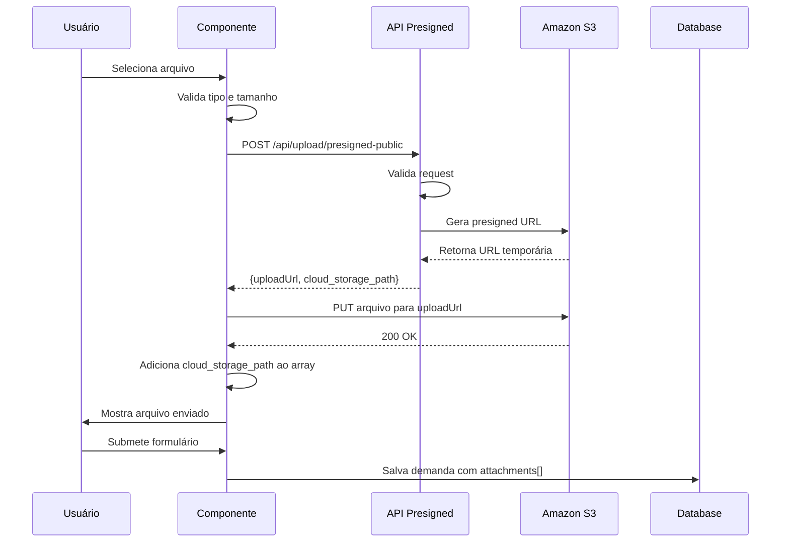

# 📎 Sistema de Upload de Arquivos

## 🎯 Visão Geral

Sistema completo de upload de arquivos para demandas públicas e internas, com integração ao Amazon S3 e suporte a múltiplos formatos.

## 📋 Formatos Suportados

### Documentos
- **PDF** - `.pdf` - `application/pdf`
- **Word** - `.doc` - `application/msword`
- **Word (novo)** - `.docx` - `application/vnd.openxmlformats-officedocument.wordprocessingml.document`
- **Excel** - `.xls` - `application/vnd.ms-excel`
- **Excel (novo)** - `.xlsx` - `application/vnd.openxmlformats-officedocument.spreadsheetml.sheet`

### Imagens
- **JPEG** - `.jpg, .jpeg` - `image/jpeg`
- **PNG** - `.png` - `image/png`
- **GIF** - `.gif` - `image/gif`
- **WebP** - `.webp` - `image/webp`

### Outros
- **Texto** - `.txt` - `text/plain`
- **ZIP** - `.zip` - `application/zip`
- **RAR** - `.rar` - `application/x-rar-compressed`

## 🔧 Configurações

### Limites
- **Máximo de arquivos por demanda:** 5
- **Tamanho máximo por arquivo:** 10 MB
- **Tamanho total recomendado:** 50 MB

### Validações
✅ Tipo de arquivo (MIME type)  
✅ Extensão do arquivo  
✅ Tamanho do arquivo  
✅ Número total de arquivos  

## 🏗️ Arquitetura

### Componentes

#### 1. **FileUpload Component** (`/components/file-upload.tsx`)
Componente React reutilizável para upload de arquivos:
- Interface visual com drag & drop style
- Preview de arquivos com ícones por tipo
- Barra de progresso
- Validação em tempo real
- Suporte para múltiplos arquivos

**Props:**
```typescript
interface FileUploadProps {
  onFilesChange: (files: string[]) => void;  // Callback com cloud paths
  maxFiles?: number;                          // Default: 5
  maxSizeMB?: number;                         // Default: 10
  publicUpload?: boolean;                     // Default: false
}
```

**Uso:**
```tsx
<FileUpload
  onFilesChange={(files) => setFormData({ ...formData, attachments: files })}
  maxFiles={5}
  maxSizeMB={10}
  publicUpload={true}
/>
```

#### 2. **API Pública** (`/api/upload/presigned-public/route.ts`)
Endpoint público (sem autenticação) para gerar URLs de upload:
- **Método:** `POST`
- **Body:** `{ fileName: string, contentType: string }`
- **Response:** `{ uploadUrl: string, cloud_storage_path: string, fileName: string }`

**Validações:**
- Tipo de arquivo na whitelist
- Nome do arquivo válido (max 255 chars)

#### 3. **API Autenticada** (`/api/upload/presigned/route.ts`)
Endpoint para usuários logados (já existia):
- Requer `session`
- Mesma funcionalidade da API pública

### Fluxo de Upload



## 📦 Integração

### No Formulário Público (`/abrir-demanda`)

```tsx
import FileUpload from "@/components/file-upload";

const [formData, setFormData] = useState({
  // ... outros campos
  attachments: [] as string[],
});

// No JSX:
<FileUpload
  onFilesChange={(files) => setFormData(prev => ({ 
    ...prev, 
    attachments: files 
  }))}
  maxFiles={5}
  maxSizeMB={10}
  publicUpload={true}  // Usa API pública
/>
```

### No Formulário Interno (`/demandas/nova`)

```tsx
<FileUpload
  onFilesChange={(files) => setFormData(prev => ({ 
    ...prev, 
    attachments: files 
  }))}
  maxFiles={5}
  maxSizeMB={10}
  publicUpload={false}  // Usa API autenticada
/>
```

## 🗄️ Armazenamento

### Amazon S3
- **Estrutura de pastas:**
  ```
  s3://bucket/
  ├── uploads/                    # Arquivos privados
  │   └── 1234567890-arquivo.pdf
  └── public/
      └── uploads/                # Arquivos públicos
          └── 1234567890-arquivo.pdf
  ```

- **Nomenclatura:** `timestamp-nome-original.ext`
- **Acesso:** Presigned URLs com expiração de 1 hora

### Database
O campo `attachments` no modelo `Demand` armazena array de cloud paths:

```typescript
attachments: [
  "public/uploads/1709856000000-documento.pdf",
  "public/uploads/1709856001000-comprovante.jpg"
]
```

## 🔐 Segurança

### Validações Implementadas

1. **Tipo de Arquivo:**
   - Whitelist de MIME types permitidos
   - Rejeição de executáveis e scripts

2. **Tamanho:**
   - Limite por arquivo (10MB)
   - Verificação client-side antes do upload

3. **Rate Limiting:** (Recomendado implementar)
   - Limitar uploads por IP
   - Prevenir abuso

4. **Sanitização:**
   - Nome do arquivo sanitizado
   - Caracteres especiais removidos

### Acesso aos Arquivos

- **Público:** URLs diretas do S3
- **Privado:** Presigned URLs temporárias
- **Expiração:** 1 hora (configurável)

## 🎨 UI/UX

### Estados Visuais

1. **Inicial:**
   - Botão "Anexar Arquivos"
   - Contador: "0/5 arquivos"
   - Texto de formatos aceitos

2. **Uploading:**
   - Loading spinner
   - Texto: "Enviando..."
   - Botão desabilitado

3. **Com Arquivos:**
   - Cards com preview
   - Ícone por tipo de arquivo
   - Nome e tamanho
   - Botão remover (X)

4. **Erro:**
   - Toast de erro
   - Mensagem específica

### Ícones por Tipo

| Tipo | Ícone | Cor |
|------|-------|-----|
| PDF | FileText | Vermelho |
| DOC/DOCX | FileText | Azul |
| XLS/XLSX | FileSpreadsheet | Verde |
| Imagens | Image | Roxo |
| Texto | File | Cinza |
| ZIP/RAR | File | Laranja |

## 📊 Visualização de Anexos

### Na Lista de Demandas
```tsx
{demand.attachments.length > 0 && (
  <Badge variant="outline">
    {demand.attachments.length} anexo(s)
  </Badge>
)}
```

### Na Página de Detalhes
```tsx
<div className="space-y-2">
  <h3>Anexos ({demand.attachments.length})</h3>
  {demand.attachments.map((path, index) => (
    <Card key={index}>
      <a href={getFileUrl(path)} target="_blank">
        <FileText /> {path.split('/').pop()}
      </a>
    </Card>
  ))}
</div>
```

## 🔄 API Reference

### POST /api/upload/presigned-public

Gera URL de upload público (sem autenticação).

**Request:**
```json
{
  "fileName": "documento.pdf",
  "contentType": "application/pdf"
}
```

**Response (Success):**
```json
{
  "uploadUrl": "https://bucket.s3.amazonaws.com/...",
  "cloud_storage_path": "public/uploads/1709856000000-documento.pdf",
  "fileName": "documento.pdf"
}
```

**Response (Error):**
```json
{
  "error": "Tipo de arquivo não permitido"
}
```

### Usar a Presigned URL

```javascript
// Upload do arquivo
await fetch(uploadUrl, {
  method: 'PUT',
  body: file,
  headers: {
    'Content-Type': file.type,
  },
});
```

## ✅ Checklist de Implementação

- [x] API pública de presigned URLs
- [x] Componente FileUpload reutilizável
- [x] Validação de tipos de arquivo
- [x] Validação de tamanho
- [x] UI com preview de arquivos
- [x] Integração no formulário público
- [x] Integração no formulário interno
- [x] Middleware para rotas públicas
- [x] Documentação completa

## 🚀 Melhorias Futuras

### Planejadas

1. **Drag & Drop:**
   - Arrastar arquivos para a área de upload
   - Visual feedback durante drag

2. **Preview de Imagens:**
   - Thumbnail das imagens
   - Lightbox para visualização

3. **Progress Bar:**
   - Barra de progresso individual por arquivo
   - Upload em paralelo

4. **Compressão:**
   - Compressão automática de imagens grandes
   - Otimização de PDFs

5. **Virus Scan:**
   - Integração com antivírus
   - Scan automático no upload

6. **Download em Lote:**
   - Baixar todos os anexos em ZIP
   - Botão na página de detalhes

## 🐛 Troubleshooting

### Erro: "Tipo de arquivo não permitido"
- Verificar MIME type do arquivo
- Adicionar tipo na whitelist se necessário

### Erro: "Arquivo muito grande"
- Verificar tamanho (máx 10MB)
- Considerar compressão

### Erro ao fazer upload para S3
- Verificar credenciais AWS
- Verificar permissões do bucket
- Verificar CORS configuration

### Arquivo não aparece na lista
- Verificar se `cloud_storage_path` foi salvo
- Verificar array `attachments` no banco

## 📞 Suporte

Para problemas com upload de arquivos:
1. Verificar console do navegador
2. Verificar logs do servidor
3. Verificar S3 bucket logs
4. Consultar documentação AWS S3

---

**Sistema de upload 100% funcional! 📎✅**
